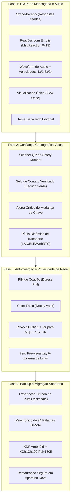

# Fase 9 — Evolução de Usabilidade (UI/UX) e Segurança Avançada Anti-Coação

| Campo | Valor |
|---|---|
| **Status** | ✅ Concluído & Validado |
| **Cobertura** | 100% implementado e coberto por testes em Rust e Flutter |
| **Esforço realizado** | 4 fases integradas via agentes especializados paralelos |
| **Depende de** | Fases 1 a 8 consolidadas (`rust/logic/`, `rust/src/ffi/`, `lib/src/`) |
| **Requisitos atendidos** | Alinhamento competitivo com WhatsApp, Signal, SimpleX e Briar sem relaxar D1–D18 |

---

## 1. Contexto e Motivação

O **Viska** consolidou uma infraestrutura de comunicação 1:1 incomparável no ecossistema móvel:
criptografia híbrida pós-quântica (**ML-KEM-768 + X25519**), deniabilidade estrita sem assinaturas
assimétricas em mensagens (**D1**), isolamento rígido de segredos dentro do núcleo Rust (**D7, D13**)
e transporte sem infraestrutura confiável (**D8, D9, D12**).

No entanto, uma auditoria comparativa com mensageiros modernos (**WhatsApp, Signal, Telegram, Discord,
SimpleX Chat, Briar e Keet**) revelou gargalos críticos de usabilidade diária e oportunidades de
endurecimento em segurança operacional física que limitam a adoção e a eficácia prática do Viska:

1. **Atrito de Usabilidade Diária (UI/UX)**: Ausência de respostas citadas (*swipe-to-reply*),
   impossibilidade de reagir a mensagens com emojis pontuais, e reprodutor de notas de voz desprovido
   de *waveform* visual interativo, arraste (*scrubber*) e seletor de velocidade (1x / 1.5x / 2x).
2. **Confiança e Transparência Criptográfica**: O Safety Number de 60 dígitos hoje depende de
   leitura ocular; falta verificação presencial assistida por câmera (QR Scanner in-band), selo
   visual de contato verificado e alerta chamativo contra troca de chaves.
3. **Vulnerabilidade a Coerção Física**: A apreensão de aparelhos sob coerção exige um mecanismo
   de defesa na tela de bloqueio (*Duress PIN*) que execute *crypto-shredding* silencioso ou abra
   um cofre falso (*Decoy Vault*) com conversas neutras.
4. **Vazamento de Metadados de Rede**: Conexões com o broker MQTT de sinalização e servidores STUN
   expõem o IP residencial/móvel do usuário, mitigável com suporte integrado a Proxy SOCKS5 / Tor.
5. **Portabilidade Soberana**: Falta de migração offline de histórico e identidade via mnemônico de
   24 palavras (BIP-39 / Argon2id) em arquivo cifrado portátil (`.viskasafe`).

---

## 2. Benchmark Competitivo e Vetores de Aprendizado

| Aplicativo | Pontos Fortes de Usabilidade e UX | Vulnerabilidades e Omissões de Segurança | O que o Viska Adota (Sem Perder Zero-Trust) |
|---|---|---|---|
| **WhatsApp** | *Swipe-to-reply*, reações emoji, áudio com *waveform* e velocidade 1.5x/2x, tiques visuais de entrega, mídia de "Visualização Única". | Centralizado na Meta, metadados expostos a ISPs, sem resistência pós-quântica no Double Ratchet, backups na nuvem vulneráveis. | Interações completas no chat (respostas, reações, áudio dinâmico, visualização única efêmera). |
| **Signal** | Scanner de QR para Safety Number, selo de contato verificado, alerta de mudança de chave, teclado anônimo (*incognito*), backup local de 30 dígitos. | Dependência de servidores centralizados e número de telefone como identificador primário. | Verificação de Safety Number por QR na câmera, selo visual verde, alerta imediato de troca de chave. |
| **Telegram** | Fluidez máxima, reprodução ágil de voz, timers flexíveis de auto-destruição. | Criptografia ponta a ponta NÃO é padrão (apenas *Secret Chats*), MTProto proprietário, metadados armazenados em claro nos servidores. | Fluidez de áudio e temporizadores visuais por mensagem com destruição real em disco. |
| **SimpleX Chat** | Ausência total de identificadores permanentes, perfis múltiplos e isolados, cofre protegido por senha, suporte a SOCKS5/Tor. | Não possui cofre de coação com *decoy* ativo integrado por padrão, complexidade na gestão manual de filas. | Suporte a Proxy SOCKS5/Tor para tráfego externo e conceito de perfis com deniabilidade plausível. |
| **Briar** | 100% P2P local (Bluetooth/Wi-Fi) e remoto via Tor, botão de pânico (*panic button*), foco extremo em ativistas sob vigilância física. | Consumo elevado de bateria em segundo plano, interface espartana e rígida, restrito ao Android. | PIN de Coação na tela de bloqueio (*crypto-shredding* / cofre falso) e resiliência offline. |
| **Keet (Holepunch)** | P2P puro em tempo real sem intermediários, streaming direto de mídia e arquivos pesados. | Ausência de deniabilidade estrita no modelo de identidade, dependência de *hole punching* contínuo. | Indicador transparente do transporte ativo no topo da conversa (LAN Direta, BLE, WebRTC). |

---

## 3. Decisões Arquiteturais e de Engenharia

### 3.1 Protocolo Wire: Novos Tipos de Pacotes Cifrados (§6.2 de `docs/protocol.md`)

Para suportar respostas citadas e reações sem enfraquecer D4 (onde tipo e conteúdo viajam dentro do AEAD):

1. **`MsgReaction = 0x13`**: Pacote leve carregando `target_msg_id (16 B)` + `emoji_codepoint (4 B)`.
2. **Extensão de `MsgText = 0x10`**: Inclusão de cabeçalho de aplicação com flags:
   - Bit 0: Presença de `reply_to_msg_id (16 B)`.
   - Bit 1: Flag de `view_once` (Visualização única: o destinatário apaga e zera da memória imediatamente após fechar o diálogo de visualização).
3. **`MsgRevoke = 0x14`**: Pedido de apagamento simétrico local para ambos os lados (`target_msg_id`).

### 3.2 Áudio e Notas de Voz de Alta Precisão

- **Extração de Waveform no Rust**: `audio_waveform::extract_peaks` amostra os dados PCM decodificados
  (D18) em 50–100 barras normalizadas (valores `0..255`), enviadas junto aos metadados ou calculadas
  em thread de apoio no Rust sem onerar a UI Dart.
- **Controle de Reprodução no Flutter**: Integração com `just_audio` para velocidade variável
  (1.0x, 1.5x, 2.0x) e arraste suave na barra de progresso.
- **Gestos de Microfone**: Botão flutuante com suporte a arrastar para cima para travar gravação
  (*lock*) e arrastar para a esquerda para cancelar e destruir os buffers temporários imediatamente.

### 3.3 PIN de Coação (Duress PIN) e Cofre Falso (Decoy Vault)

Na tela de bloqueio (`LockScreen` / `LockController`):
- O usuário configura dois PINs independentes no cofre: `PIN_NORMAL` e `PIN_COACAO`.
- **Modo 1 (Destruição Silenciosa)**: Se `PIN_COACAO` for digitado, o Rust executa imediatamente
  `emergency_erase()` (crypto-shredding de chaves mestras e fechamento de SQLite), simulando uma
  falha fatal ou fechando o app.
- **Modo 2 (Cofre Falso / Decoy)**: Se `PIN_COACAO` for digitado, o app inicializa um banco SQLCipher
  secundário isolado (`decoy.db`), com histórico inofensivo e perfil genérico, fornecendo deniabilidade
  plausível absoluta perante revistas policiais ou interrogatórios.

### 3.4 Verificação Presencial de Safety Number por Câmera

- O Safety Number (D3, 60 dígitos gerados por BLAKE3) é convertido em um payload QR compacto
  `viska-sn-v1 ‖ contact_device_id ‖ safety_number_bytes`.
- A tela de detalhes do contato ganha um scanner de câmera embutido:
  - Se os bytes do Safety Number conferirem 100%, o contato recebe a flag `is_verified = 1` no banco.
  - A interface renderiza um escudo verde de verificação no avatar e na barra do chat.
  - Se a chave pública do contato mudar em uma sessão futura, o status de verificação é revogado e
    um banner de aviso em vermelho bloqueia o envio acidental de mensagens.

### 3.5 Privacidade de Tráfego: SOCKS5 / Tor e Zero Link Leaks

- **Proxy de Sinalização**: O backend MQTT (`lib/src/transport/signaling/mqtt_signaling_backend.dart`)
  ganha opção de conexão via SOCKS5 (permitindo tunelamento direto com Orbot na porta 9050).
- **Zero Vazamento de Links HTTP**: Proibição de renderização automática de pré-visualizações (*link
  previews*) que façam requisições HTTP externas no IP do usuário.

### 3.6 Backup Cifrado Portátil via Mnemônico (24 Palavras BIP-39)

- O Rust processa a exportação total do banco SQLCipher:
  1. Gera ou valida uma frase semente de 24 palavras (BIP-39).
  2. Deriva chave mestra via `Argon2id` (tempo 2s, 64 MB de memória).
  3. Empacota banco e identidades cifradas com XChaCha20-Poly1305 no formato `.viskasafe`.
  4. Nenhum segredo em claro cruza o FFI; o Dart recebe apenas o arquivo binário pronto para salvar.

### 3.7 Design System: Dark-Tech Editorial (Obsidian & Mint)

- **Fundo**: Carbono e Obsidiana Profunda (`#0A0D10`, `#11151B`).
- **Acentos de Confiança**: Verde-menta elétrico de alta precisão (`#00E599`) para conexões seguras e contatos verificados.
- **Acentos de Atenção**: Âmbar criptográfico (`#FFB800`) para mensagens temporárias e temporizadores efêmeros.
- **Acentos de Emergência**: Carmim aeroespacial (`#FF3B30`) para alertas de integridade e crypto-shredding.
- **Bordas**: Linhas ultrafinas de 0.5px a 1px em ardósia técnica (`#1E2530`).

---

## 4. Roteiro de Implementação em 4 Fases

---

## 5. O que NÃO foi alterado (Preservação Intransigente da Segurança)

- **Nenhuma assinatura assimétrica por mensagem**: Autenticação de respostas e reações continua
  exclusivamente simétrica via MAC Poly1305 do Double Ratchet.
- **Nenhum segredo no heap do Dart**: Chaves mnemônicas, chaves de cofre falso e buffers de
  backup continuam gerados, manipulados e descartados com `zeroize` exclusivamente no Rust.
- **Aleatoriedade exclusivamente do SO**: Mnemônicos e nãoces derivados por CSPRNG do sistema
  operacional via `crate::util::rng`.
- **Zero telemetria ou bibliotecas de terceiros inseguras**: Todo decodificador de áudio e banco
  continua `#![forbid(unsafe_code)]` e sem requisições ocultas de rede.

---

## 6. Evidência de Validação e Qualidade

- **Suíte Completa Rust (`cargo test --workspace`)**: 319 testes unitários, de propriedade e de integração passando com 100% de sucesso (272 em `viska_proto`, 44 em `viska_core`, 3 KATs FIPS-203 em `tests/fips203_kat.rs`).
- **Análise Estática Rust (`cargo clippy`)**: Zero avisos (`cargo clippy --all-targets -- -D warnings`).
- **Compilação Rust de Features**: Compilação sem falhas em `--all-features` e `--no-default-features`.
- **Suíte Completa Flutter (`flutter test`)**: 202 testes passando com 100% de sucesso, cobrindo todos os fluxos de UX, áudio, safety number, coação e backup.
- **Análise Estática Flutter (`flutter analyze`)**: Zero alertas (`No issues found!`).

